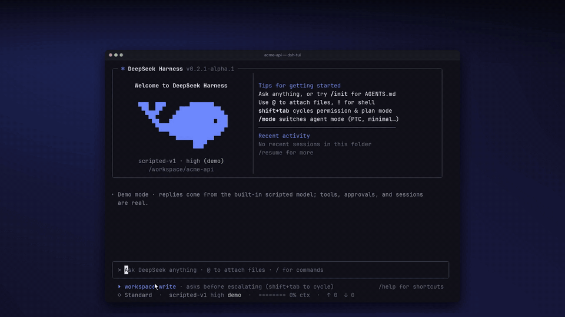
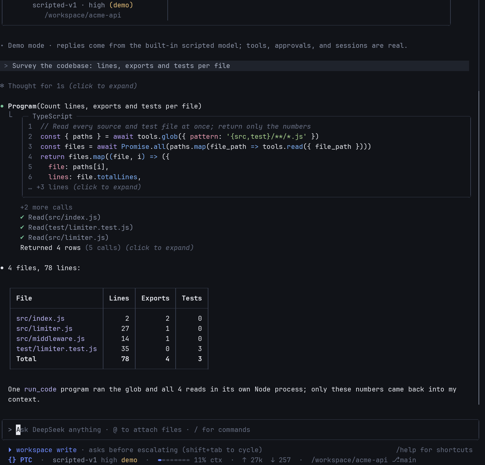
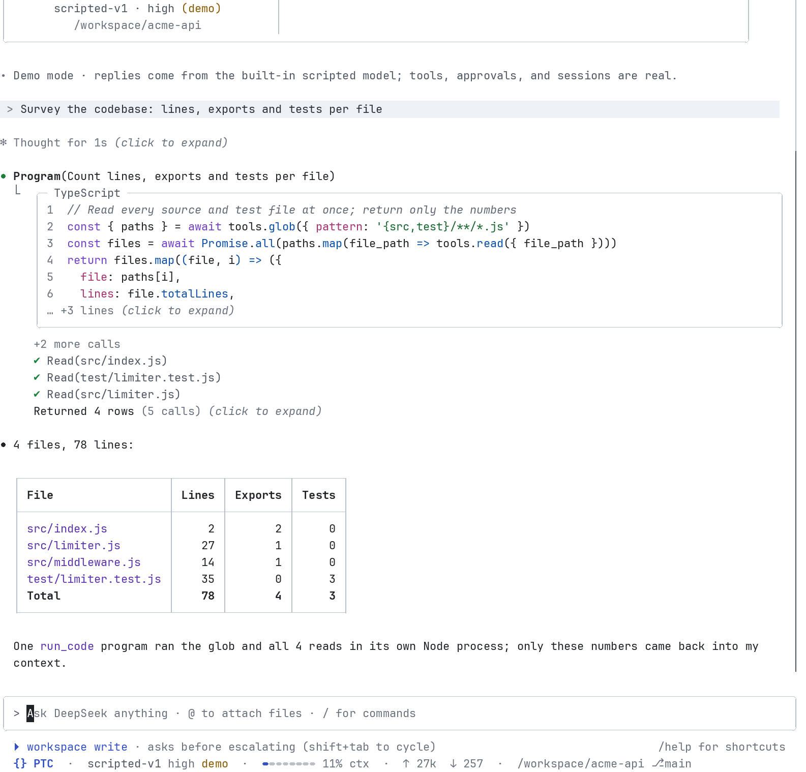

# @deepseek-ai/dsh-experimental-tui

## Summary

A Claude Code–style terminal UI for DeepSeek Harness, packaged as a profile
bundle (`dsh --profile tui`). It runs in-process on the real harness: agents,
tools, sandbox approvals, plan mode, questions, sessions, compaction, goals,
subagents and the command registry are the harness's own services. Sessions
run in one of the same four agent modes as the Web surface: Standard, PTC,
Minimal and Creator.

## Table of Contents

- [Showcase](#showcase)
- [Run](#run)
- [Modes](#modes)
- [Auto review](#auto-review)
- [Features](#features)
- [Mouse](#mouse)
- [Themes](#themes)
- [Test](#test)
- [Dev Note](#dev-note)

## Showcase

[](docs/promo.mp4)

A 70-second tour, recorded from real sessions with the built-in scripted demo
model (`--demo`): `@` file mentions, tool cards with diffs, the four agent
modes, a PTC program running its tool calls in parallel, mouse selection and
scrolling, plan mode with questions and plan review, a dark-to-light theme
flip, slash commands and the provider picker.

- Video: [docs/promo.mp4](docs/promo.mp4) (1920x1080, 30 fps, h264 + AAC)
- GIF (modes and PTC, 15 s): [docs/promo.gif](docs/promo.gif)
- Poster: [docs/poster.png](docs/poster.png)

This TUI is an independent, community-built experiment on top of DeepSeek
Harness, not an official DeepSeek product.

## Run

```bash
packages/experimental/tui/bin/dsh-tui            # real models (needs DEEPSEEK_API_KEY or `dsh auth`)
packages/experimental/tui/bin/dsh-tui --demo     # scripted demo model, no key needed
packages/experimental/tui/bin/dsh-tui -c         # continue the latest session here
packages/experimental/tui/bin/dsh-tui -r <id>    # resume a session
packages/experimental/tui/bin/dsh-tui --no-mouse # classic inline UI (native scrollback and selection)
packages/experimental/tui/bin/dsh-tui --theme light
packages/experimental/tui/bin/dsh-tui --mode ptc # start new sessions in an agent mode
```

With no credentials and no `-m`, the TUI starts on a clearly labelled scripted
demo model (`dsh-tui-demo/scripted-v1`). It only replaces the LLM. The tool
calls it emits still run through the harness's real tools, sandbox and approvals.

## Modes

An agent mode is an agent preset: the tools, prompt sections, skills and
services one session is built from. The TUI composes the same preset registry
and the same four presets as the Web surface.

| Mode | Badge | What the model gets |
| --- | --- | --- |
| Standard (default) | `◇ Standard` | Search, read, edit and shell tools, plan mode, subagents, skills, todos and web tools. |
| PTC | `{} PTC` | The Standard tools, but the model sees only `run_code`. It writes a TypeScript program that calls the tools as `await tools.<name>(…)`, so it can batch calls, run them in parallel and filter the results before anything enters its context. |
| Minimal | `$ Minimal` | A one-line system prompt and a single persistent `bash` tool, for testing and comparing raw model behaviour. It has no plan mode. |
| Creator | `✦ Creator` | Standard plus Plugin Manager, the Cordis inspect tools and the composition-authoring skills, for customising dsh by conversation (plugins, MCP setups, your own modes). |

- Pick a mode with `--mode <standard|ptc|minimal|creator>` (or `DSH_TUI_MODE`), with `/mode`, or by clicking the badge at the start of the status line.
- A session keeps its mode. Switching starts a new session, and the old one stays in `/resume`. Resuming a session rebuilds the mode it was created with.
- Custom presets in your profile (for example, ones written in Creator mode) appear in `/mode` too.
- Shift+Tab still cycles only the permission presets and plan mode.
- `/tools` lists the tools of the current mode. In PTC it lists the tools that programs can call.

| PTC program (dark) | PTC program (light) |
| --- | --- |
|  |  |

More: [mode picker](docs/screenshots/25-mode-picker.png), [PTC fix](docs/screenshots/27-ptc-fix.png), [Minimal fix](docs/screenshots/28-minimal-fix.png), [Creator mode](docs/screenshots/29-creator-mode.png), each with a `-light` variant.

**PTC programs in the transcript.** A `run_code` call renders as a
`Program(<description>)` card. The program is shown syntax-highlighted
(collapsed to a few lines; click or Ctrl+O to expand). Each `tools.*` call it
makes is folded underneath like a subagent step, with its own live status
(`…` running, `✔` done, `✘` failed). While it runs, the footer counts calls and
shows how many are running in parallel. When it finishes, the card shows what
the program returned (`Returned 4 rows (5 calls)`).

**Differences from the Web presets.** The presets in [`presets/`](presets) are
derived from the Web bundle's presets, and `tests/presets.spec.ts` fails if they
drift apart. There are two differences:

- The persona says it is working in an interactive terminal.
- `tool-schedule` is disabled. Its tools need the host `schedule` service, which needs the Web session controller.

In Creator mode, inspect queries that need a connected Web page report that
no page is connected.

**Demo model.** `--demo` runs each mode. Try these prompts:

- `The limiter tests are failing, please fix them` (in any mode; Minimal fixes it with nothing but the shell).
- `Survey the codebase: lines, exports and tests per file`. Standard uses a glob and one read per file. PTC uses one program whose reads run concurrently, and only the numbers come back.
- `How do I create a new mode for code review?` (in Creator mode).

## Auto review

Auto review is an optional, **experimental** permission preset from
[`@deepseek-ai/dsh-experimental-auto-review`](../auto-review). Before each tool
call, including each `tools.*` call inside a PTC program, the current model
reviews the pending action. An allowed call runs with full access, and a denied
call asks you. It can allow unsafe actions or deny useful work, and every review
spends extra tokens.

It is not installed by default. To install it into the `tui` profile from this
checkout, then restart the TUI:

```bash
pnpm dsh plugin --profile tui add ./packages/experimental/auto-review
```

Select **Auto review** `EXP` in `/permissions`, or run `/permissions auto`.
The first time in each session, you are asked to confirm the risk. Shift+Tab
never cycles into Auto review. To remove it:

```bash
pnpm dsh plugin --profile tui remove @deepseek-ai/dsh-experimental-auto-review
```

The demo model answers Auto review requests too: it allows project-local work,
allows network lookups as medium risk, and denies destructive or publishing
commands, so you can see the approval fallback.

## Features

- Welcome banner with a blue, six-row Unicode block whale, a forked tail and a pectoral fin.
- Chat REPL with a bordered composer, multi-line editing (Shift+Enter / Ctrl+J / `\`), emacs keys, history (↑/↓), bracketed paste.
- Streaming Markdown with syntax-highlighted code blocks and boxed tables.
- `⏺` / `⎿` tool-step blocks with live status, real-line-number diffs, folded subagent steps, and PTC program cards.
- Permission prompts (Yes / don't ask again / No), clarifying-question tabs, and a plan-review overlay.
- Four agent modes (`/mode`, `--mode`). Shift+Tab cycles workspace-write → plan mode → full access. Esc interrupts. Ctrl+O toggles the detailed transcript.
- `@file` mentions with fuzzy autocomplete, `!` shell mode and `#` memory notes.
- Status line: agent-mode badge, model, effort, a context meter, tokens, cwd and git branch, goal and jobs.
- Fullscreen transcript with full mouse support (see below); `--no-mouse` keeps the classic inline UI.
- Dark and light themes with terminal background detection (`/theme`).
- Slash commands: /help /clear /mode /model /effort /permissions /cost /context /status /config /history /resume /todos /tools /skills /jobs /agents /mcp /memory /init /export /copy /diff /logs /mouse /theme /exit. Harness commands such as /compact and /goal also appear in the menu.

## Mouse

The TUI runs fullscreen (alternate screen) with mouse reporting on by default.

| Do | Result |
| --- | --- |
| Wheel / trackpad | Scroll the transcript. Wheel notches move a fixed step; trackpad streams scroll smoothly with acceleration. Over an open menu or picker, the wheel moves its selection. |
| Click a tool header or `(click to expand)` | Expand or collapse that block. Hovering a header shows `▸ click to expand`. |
| Drag | Select text. On release it is copied (OSC 52, plus `pbcopy`/`wl-copy`/`xclip`/`xsel`/`clip.exe` when available). Dragging past the top or bottom edge auto-scrolls. |
| Double / triple click | Select a word / a line. Shift-click extends the selection. Right-click copies it again. |
| Ctrl+C / Esc with a selection | Copy it / clear it (before their usual meaning). |
| Click a link | Open it in the browser. |
| Click `↓ N lines below · Back to bottom` or the scrollbar | Jump to the bottom / seek. |
| Click in the prompt | Place the cursor there. |
| Click a slash or `@` menu row, an approval option, a question option or tab, a picker row | Choose it (the same as its number key). |
| Click the mode hint / agent-mode badge / model name / `esc to interrupt` in the footer | Cycle the permission mode / open `/mode` / open `/model` / interrupt. |

Keyboard scrolling: PgUp/PgDn, Shift+↑/↓, Ctrl+Home/Ctrl+End.

**Native terminal selection.** While the app captures the mouse, hold a
modifier to let the terminal select instead: Shift+drag in most terminals
(GNOME Terminal, Konsole, kitty, WezTerm, Alacritty, Windows Terminal,
xterm), ⌥ Option+drag in iTerm2, fn+drag in macOS Terminal (or toggle
View ▸ Allow Mouse Reporting with ⌘R). Or run `/mouse off` to give the mouse
back to the terminal (PgUp/PgDn still scroll; `/mouse on` restores it), or
start with `--no-mouse` for the classic inline UI with native scrollback.

Defaults adapt to the environment: inline under Zellij and iTerm2's tmux
integration (`tmux -CC`), and fullscreen without capture when tmux's own
`mouse` option is off. Mouse and focus reporting are switched off on every
exit path: `/exit`, Ctrl+C, Ctrl+Z (re-enabled after `fg`), SIGTERM/SIGHUP,
and crashes. When the app leaves fullscreen it prints the conversation to the
normal screen so it stays in your scrollback.

| Environment variable | Effect |
| --- | --- |
| `DSH_TUI_MOUSE=0` / `1` | Same as `--no-mouse` / `--mouse`. |
| `DSH_TUI_COPY_ON_SELECT=0` | Do not copy on release (Ctrl+C, right-click or `/copy` still copy). |
| `DSH_TUI_SCROLL_MODE=auto\|wheel\|trackpad` | Force how wheel events are interpreted. |
| `DSH_TUI_SCROLL_LINES`, `DSH_TUI_SCROLL_SPEED`, `DSH_TUI_SCROLL_INVERT=1`, `DSH_TUI_SCROLL_EVENTS_PER_TICK` | Tune scrolling. |

## Themes

Dark and light palettes. Every colour role keeps readable contrast on its
background (the tests check WCAG ratios), and the light theme never relies on
SGR dim. The theme is chosen in this order:

1. `--theme auto|dark|light`, then `DSH_TUI_THEME`, then `/theme`, which is
   saved to `$DSH_HOME/tui.json`.
2. `auto`: ask the terminal for its background colour (OSC 11, with a short
   timeout), then `COLORFGBG`, then the default Terminal.app profile on macOS,
   and finally dark.

`/theme` with no argument opens a picker that shows what was detected.

## Test

```bash
npx vitest run packages/experimental/tui
npx tsx scripts/run-oxlint.ts packages/experimental/tui
```

## Dev Note

- From a source checkout, `bin/dsh-tui` runs `src/` directly (tsx resolves the package through the `tsconfig.base.json` alias), so the `.tsx` files carry an `@jsxRuntime automatic` pragma. `npx tsc -b && node scripts/bundle.mjs` builds `lib/` for packaging.
- Mouse code lives in `src/mouse/` (protocol filter, scroll normaliser, selection, clipboard, controller); the fullscreen layout is `src/ui/fullscreen.tsx` and the transcript line map is `src/viewport.ts`. Terminal modes are restored by `src/mouse/terminal.ts` on every exit path.
- Both screen modes render with Ink's incremental renderer (`src/render-options.ts`), so a keystroke repaints only the prompt line. `tests/render-options.spec.ts` guards this: without it, inline mode erased and redrew the whole live region on every keystroke, which flickers on terminals without synchronized output such as macOS Terminal.app.
- Modes use `@deepseek-ai/dsh-agent-preset-registry`, as the Web bundle does. `cordis.patch.yml` disables the host agent-plane rows that the presets now own, and inserts the registry plus the host services the presets need: subagent model selection, the Cordis host runner and its inspect providers. Each session is created and resumed with `presets.mount(agentCtx, id)` in its setup, and the session's `agentPreset` projection records which preset it uses. `src/modes.ts` holds the labels and aliases; `Bridge.service()` reads a mode's isolated services, such as `planMode` and `skills`.
- PTC rendering: `src/transcript.ts` folds the `tool/ptc-dispatch-start` and `tool/ptc-dispatch` events into the `run_code` item's children, and `src/render.ts` (`renderProgram`) draws the card. The demo model (`src/demo/surface.ts`) detects the mode from the offered tools and wraps each scripted step in one `run_code` program.
- Colour tables are built with `themed()` from `src/theme.ts` so that `/theme` can rebuild them; add new colours as palette roles, not literal hex values.
- The mouse design follows OpenAI Codex and xAI Grok Build (both Apache-2.0); see [NOTICE](NOTICE).
